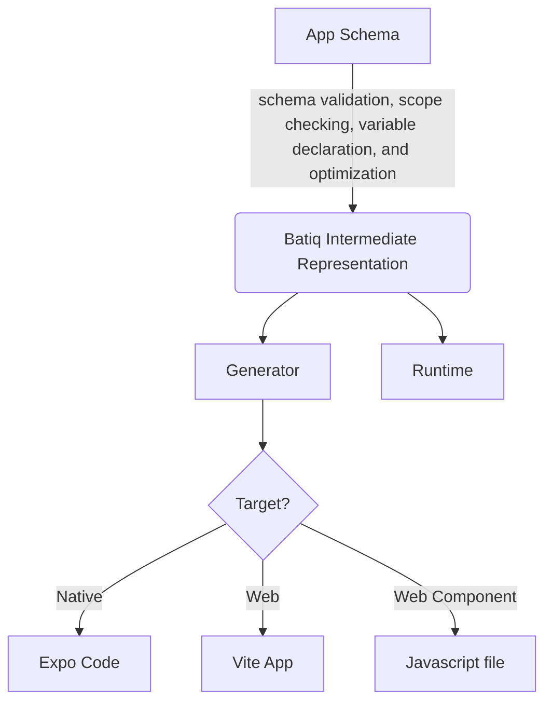

# ir

This library was generated with [Nx](https://nx.dev).

## Building

Run `nx build ir` to build the library.

## Running unit tests

Run `nx test ir` to execute the unit tests via [Jest](https://jestjs.io).
